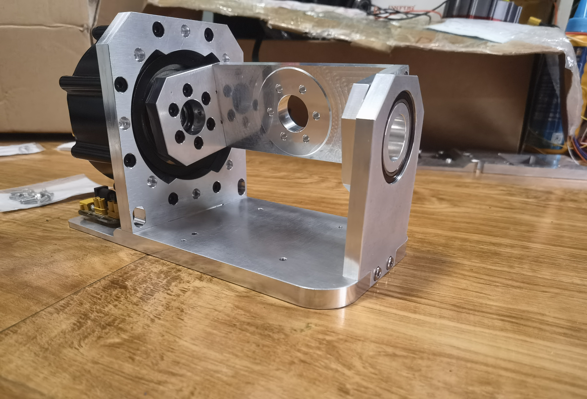

# FFB-BASE-CNC-UNI
通用FFB底座CNC版本 
为适配灵足03和伺泰威GIM8108-8电机而改进的底座，只需要更换中间连杆就可以适配两种电机。今后改进都以这个图纸为基础。灵足03的额定扭矩有20nm，如果不加延长杆，其实力矩有点过剩了。伺泰威8108性价比很高，额定8nm的扭矩，可以满足绝大多数游戏向玩家。 
零件根据铨洲CNC打样的要求，对工艺和尺寸进行了优化，尽量降低成本。在加工所有侧孔和所有螺纹孔攻丝的情况下，打样灵足03用的一套价格大概260块，如果去掉侧孔、不攻丝，打样成本可以降到大概110块。 
安装步骤为： 
1.先装好底板和roll电机座

2.组装连杆

3.把轴承装进轴承座，这里配合比较紧，我用台钳压的

4.装上roll电机

5.把连杆固定到roll电机上

6.安装轴承座

7.安装pitch电机

除了6个结构件使用CNC以外，杆头底座目前CNC成本太高，仍然采用3D打印。
 BOM
<table>
<tr><th rowspan='2'>名称</th><th>灵足03</th><th>GIM8108</th></tr>
<tr><th>数量</th><th>数量</th></tr>
<tr><td>M4x12杯头螺钉</td><td>35</td><td>15</td></tr>
<tr><td>M3x10杯头螺钉</td><td>2</td><td>22</td></tr>
<tr><td>6806轴承</td><td colspan='2' align='center'>1</td></tr>
</table>
 
补充：
1.“通用FFB底座CNC版本.step”这个文件是全图，里面包含了灵足和8108电机需要的全部部件，自己得根据自己用的电机选择，不用全部打样
2.为了方便，我把打样的独立文件放在“CNC打样用的分立部件图”目录里面，其中“通用”里面的3个件都要用到，另外两个目录里面的根据电机选择
3.总图里面的底板和电机座上在两侧加了4个孔，是打算将来安装外壳用的，我打样的时候把这侧孔去掉了，如果要一起加工出来，会贵差不多70块
